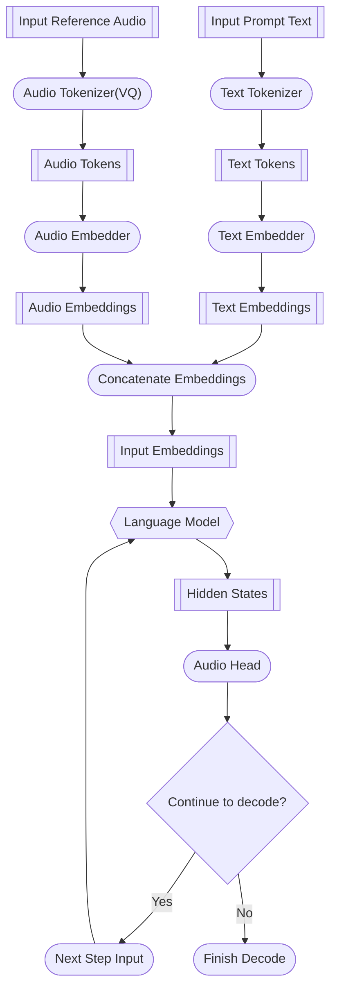
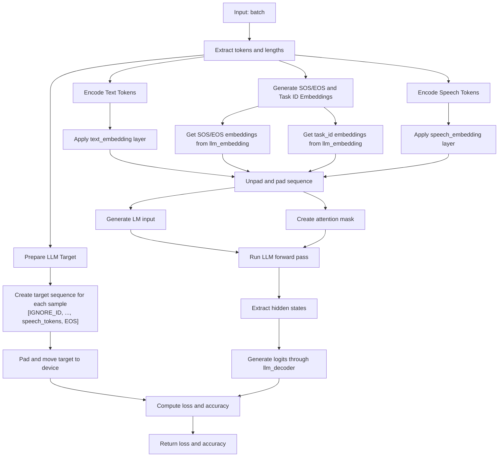

# RWKVTTS
This project is to train an RWKV LLM for TTS generation which compatible to other TTS engine(like fish/cosy/chattts).

For most of modern LLM based TTS engine, there are two parts :
1. VQ VAE: this model is to encode audio to audio tokens and decode audio tokens to audio.
2. LLM: this model is to generate audio tokens using text tokens and the prompt audio tokens. The prompt audio tokens are also from VQ VAE.

Typically the training of the LLM based TTS involves VQ-VAE training and LLM training, like CosyTTS, ChatTTS and FishTTS. However we focus to train an RWKV LLM model to replace the LLM part in these TTS engines.



Different TTS engines might have different data layout and different special control token, so we need to prepare different data and train a RWKV LLM model for each TTS engine.

# Process to train LLM for different TTS engine

## Cosy 2.0

### Cosy 2.0 Data Layout

The layout of Cosy 2.0 for LLM:


The forward of LLM for cosy 2.0:


There are some points to note for Cosy 2.0:
1. The prompt audio tokens are used to act reference audio, LLM will generate audio tokens mimic the reference audio.
2. '<|endofprompt|>' is used for prompt text, it is a special token to indicate this prompt is an instruction. 

### Cosy 2.0 Data Preparation

1. Download reference audio files from https://huggingface.co/datasets/yueyulin/TTS_Reference and put them to folder $REF_AUDIO_DIR. These audios are used to generate audio tokens.
2. Download Cosy 2.0-0.5B model from https://huggingface.co/FunAudioLLM/CosyVoice2-0.5B and put it to folder $MODEL_DIR.
3. Clone the Cosy 2.0 repo from:https://github.com/yynil/CosyVoice and follow the instruction to install the environment. In this repository, I change the codes to allow user to specify cuda device for multiple processes generation. If you have installed torch 2.6, please remember to force triton downgrading to 3.1.0.
4. Prepare the text data for audio tokens's training dataset. Currently we support parquet files and jsonl files. The text field is the only required field in the data file. I download the parquet from [wikipedia](https://huggingface.co/datasets/wikimedia/wikipedia) for Chinese and Engish parquet files.
5. Generate the audio tokens using the following command:
```bash
bash run_multiple_process.sh --parquet_files /home/yueyulin/data/wiki/zh/train-00000-of-00006.parquet /home/yueyulin/data/wiki/zh/train-00001-of-00006.parquet /home/yueyulin/data/wiki/zh/train-00002-of-00006.parquet /home/yueyulin/data/wiki/zh/train-00003-of-00006.parquet /home/yueyulin/data/wiki/zh/train-00004-of-00006.parquet /home/yueyulin/data/wiki/zh/train-00005-of-00006.parquet --language zh --prompts_dir extract_data/prompts/zh --device cuda:0 --output_dir /home/yueyulin/data/speech_corpus
```
The prompts_dir  is the $REF_AUDIO_DIR, the parquet_files are the list of files downloaded from wikimedia, each file is processed by one file. In my experience, one 4090 can process 6 files at the same time. The output_dir is the dirctory that audio tokens generated and saved.


### Cosy 2.0 LLM Training
After data is generated and saved, we will get the JSONL files like :
```json
{"text": "甄别重点监测企业是确保监测数据全面性和代表性的基础。首先，需要根据预警机制的覆盖范围和目标，明确监测企业的选择标准。选择标准可以包括企业规模、市场份额、行业影响力等。其次，通过企业调查、行业协会推荐等方式，初步筛选出符合条件的潜在监测企业。", "tts_speech_tokens": [2031, 4137, 6405, 6405, 6405, 6405, 6405, 6324, 6324, 6324, 6324, 6324, 6324, 4218, 1761, 4509, 2333, 4483, 5934, 6258, 1929, 3482, 314, 2300, 957, 5163, 6309, 5064, 6425, 3992, 1932, 80, 305, 734, 1479, 5650, 2472, 4778, 4487, 6175, 5667, 5373, 2187, 4851, 137, 141, 4919, 4407, 2436, 1295, 2024, 1294, 4940, 4778, 2330, 764, 1762, 2031, 1788, 5943, 5319, 5238, 5338, 3872, 1614, 4920, 6055, 6027, 3084, 5343, 4605, 2330, 218, 2172, 572, 1949, 1331, 865, 4921, 2472, 4688, 4379, 5850, 6342, 6373, 2997, 2529, 5087, 623, 3700, 6292, 6291, 5823, 5830, 2102, 1041, 6225, 6316, 3887, 889, 5487, 3813, 1626, 953, 734, 909, 4314, 4804, 4821, 4463, 23, 4683, 4678, 2724, 4832, 992, 1238, 2673, 324, 2099, 2486, 135, 2001, 4537, 5271, 2519, 957, 1699, 953, 1304, 1028, 4752, 2553, 5560, 4154, 1287, 59, 879, 4921, 2499, 5748, 5019, 240, 5889, 6264, 4293, 2186, 2105, 2005, 6405, 6405, 6324, 6324, 6324, 4137, 4218, 3651, 6048, 3132, 1433, 1457, 3962, 4515, 2482, 4490, 4561, 4669, 6054, 6270, 6316, 4615, 4781, 575, 632, 2031, 183, 4598, 4479, 6181, 5496, 4128, 3887, 1943, 1861, 6288, 5343, 6072, 3319, 2733, 322, 1187, 1727, 1807, 4921, 4677, 5668, 5019, 2427, 2976, 6066, 5332, 63, 73, 380, 4239, 6534, 6543, 5101, 1452, 213, 5921, 2273, 6453, 4347, 4537, 4459, 11, 2124, 866, 386, 485, 2511, 333, 632, 4317, 5772, 5803, 1457, 2163, 889, 5021, 2381, 5675, 5056, 5092, 1951, 3888, 3645, 4218, 6405, 6324, 4137, 1884, 1646, 2726, 377, 3992, 5529, 2481, 6054, 3822, 5340, 2330, 71, 2733, 2499, 5012, 4463, 5850, 6342, 6373, 2268, 4851, 137, 151, 4921, 4435, 4650, 528, 1295, 1295, 2023, 2753, 4850, 4570, 2243, 1047, 56, 113, 4512, 5568, 1662, 971, 5, 1480, 6387, 1045, 65, 460, 2160, 5102, 4568, 5056, 5098, 1602, 6048, 4367, 956, 59, 1524, 6405, 6405, 6324, 6324, 6324, 6324, 6324, 4137, 2031, 2706, 5325, 1653, 3887, 2219, 3667, 5664, 803, 4592, 2163, 5587, 4598, 5026, 5089, 1692, 5976, 1937, 146, 41, 1507, 1950, 2031, 0, 2349, 343, 4607, 5019, 566, 1683, 2166, 5051, 5678, 5057, 5830, 573, 2835, 2856, 5099, 707, 947, 1113, 4675, 4408, 4623, 1294, 2024, 2023, 3481, 4778, 2411, 1208, 1302, 660, 5827, 5345, 5074, 4560, 6501, 1403, 635, 716, 680, 5057, 4970, 1947, 3645, 1458, 1707, 6024, 6049, 5238, 5340, 1696, 5244, 1468, 1946, 509, 1318, 6534, 2800, 4510, 2234, 1991, 2017, 2018, 1370, 470, 2891, 4997, 1972, 1701, 5832, 1458, 1950, 4860, 5589, 1946, 1949, 509, 5369, 4966, 5019, 4849, 2411, 314, 1293, 1267, 377, 6421, 4800, 4416, 4893, 8, 1946, 1967, 1584, 4615, 5019, 2510, 867, 63, 245, 533, 1991, 4218, 6405, 6405, 6324, 6324, 6324, 6324, 6324, 4137, 1950, 4920, 4516, 276, 2024, 4777, 4194, 6373, 5643, 4851, 4448, 65, 1517, 1978, 4218, 6405, 4218, 2112, 1350, 4860, 5074, 5772, 6262, 672, 5097, 5090, 221, 1032, 4675, 4408, 285, 1295, 1294, 557, 4490, 228, 276, 4858, 4807, 2870, 1675, 6051, 1539, 4141, 1946, 4133, 6320, 4699, 982, 1950, 5832, 5835, 3645, 1947, 5589, 5589, 4136, 1946, 1235, 4642, 4993, 4857, 4598, 62, 4431, 4675, 285, 1043, 314, 2414, 2760, 2850, 5094, 3158, 1214, 1032, 2997, 2763, 5345, 5100, 402, 4677, 4857, 4543, 5, 1482, 2004, 56, 515, 1970, 2077, 6534, 3488, 5591, 5690, 5869, 5319, 2331, 5342, 1688, 1679, 1735, 4218, 6324, 6324, 6405, 4218, 2031, 5886, 6291, 6480, 2883, 5829, 5826, 2175, 5799, 5826, 2186, 2183, 5940, 5322, 120, 5918, 4571, 4687, 3813, 962, 737, 1561, 5886, 4077, 1429, 5831, 6560, 3644, 6429, 6507, 6534, 2101, 2186, 5097, 2682, 2673, 2017, 2576, 4594, 1005, 4785, 2760, 854, 1946, 683, 4844, 2733, 4695, 4840, 2192, 1482, 72, 29, 788, 1761, 4921, 4408, 2517, 566, 35, 2192, 5934, 4209, 5652, 4537, 5920, 278, 160, 3462, 4686, 5021, 4490, 5853, 3912, 6374, 2997, 4716, 2567, 140, 3462, 4435, 2436, 1295, 1295, 2023, 3482, 4769, 4598, 89, 1736, 4218, 6405, 6405, 6324, 6324, 4137], "prompt_text": "那么就在两侧的象限同时忙碌。", "llm_prompt_speech_token": [3686, 6324, 4137, 1959, 3666, 4376, 2836, 2127, 578, 2441, 1041, 2337, 6073, 3560, 1369, 5650, 4691, 5192, 2924, 89, 1687, 1539, 4218, 1848, 160, 4760, 2825, 1463, 1946, 1223, 1313, 2067, 5648, 2997, 2268, 2277, 4842, 4763, 308, 1038, 140, 842, 2983, 4672, 4650, 4696, 5995, 5603, 1238, 1238, 4672, 4650, 4777, 2474, 8, 767, 1731, 4299, 2079, 4941, 4947, 665, 719, 4319, 6424, 5067, 5967, 6048, 5967, 5238, 1523, 3875, 3872, 4314, 661, 1946, 1217, 500, 6422, 1506, 4852, 5831, 1457, 1448]}
{"text": "Once all the Cabinet and Cabinet-level officers have been invested, the act of their investiture usually ends with a \"family photo\" of the new Administration around the new president and vice-president. For this photo, the new ministers' alignment and proximity to the president is dictated by the order of precedence, with the ministers who head older departments standing in the first row, and the heads of the newer departments standing in the back rows. Some departments, such as the Department of Defence, take precedence from prior departments now abolished.", "tts_speech_tokens": [764, 35, 1896, 4299, 6486, 4299, 4299, 4299, 4218, 651, 2112, 2131, 1403, 2792, 2207, 1725, 5401, 281, 575, 683, 4997, 3474, 4492, 195, 87, 5109, 5846, 6077, 2270, 2172, 3828, 4424, 4543, 1520, 1753, 6258, 4075, 141, 5109, 5845, 3647, 1188, 3987, 3750, 4414, 1516, 4180, 5014, 5348, 1441, 6534, 5075, 5100, 1274, 1301, 3569, 3488, 3996, 6183, 4752, 4919, 2328, 3158, 6071, 5264, 5482, 5403, 5844, 5837, 191, 2139, 1839, 2255, 831, 4508, 4576, 6255, 1857, 29, 2, 2228, 5482, 6459, 2004, 2253, 2267, 2255, 885, 2112, 1788, 5916, 5835, 5919, 5919, 5919, 4056, 4299, 2058, 2982, 1295, 305, 1463, 3647, 2383, 2112, 3054, 4603, 3043, 4272, 2260, 4841, 6029, 6062, 5329, 6256, 6465, 2386, 2921, 2204, 4429, 5647, 2085, 2490, 809, 159, 546, 5325, 5298, 917, 1688, 3863, 3872, 3884, 3481, 3480, 4130, 5993, 5979, 5322, 5257, 5634, 4691, 4533, 5100, 1277, 764, 5111, 5, 47, 3748, 4929, 2376, 3583, 2990, 6456, 2232, 2306, 6507, 6210, 4463, 5840, 2270, 4071, 5693, 4663, 5100, 5226, 6510, 6534, 2900, 2567, 137, 882, 1199, 2831, 632, 389, 4251, 4191, 73, 49, 3831, 404, 971, 4853, 4613, 4074, 4314, 2417, 3750, 4507, 4416, 4594, 3624, 5325, 962, 224, 404, 5295, 4596, 2238, 3670, 3848, 4339, 1676, 812, 2441, 6097, 3934, 2261, 3750, 1564, 3401, 6074, 5823, 1383, 4293, 3816, 3734, 2219, 4450, 5482, 2996, 150, 3063, 143, 3019, 3667, 149, 3748, 4278, 4347, 3485, 5270, 4858, 5239, 2568, 2028, 4050, 3011, 32, 2264, 4672, 2991, 888, 804, 149, 2234, 5934, 1744, 2112, 3975, 5916, 5943, 5919, 5943, 5919, 5946, 5916, 3972, 4299, 6402, 6534, 1927, 140, 1038, 2263, 4567, 4413, 5563, 4672, 3999, 6264, 4826, 2810, 2567, 228, 227, 2324, 2504, 1773, 6375, 77, 3831, 754, 3401, 4612, 6498, 4311, 2411, 831, 2255, 4414, 5320, 4920, 2328, 5345, 5169, 4752, 4763, 5014, 6449, 2687, 3413, 3647, 2276, 3670, 4069, 1883, 2330, 4499, 1525, 1762, 1490, 2921, 1639, 2166, 4050, 4304, 2837, 732, 6049, 5405, 2266, 910, 4315, 2399, 798, 4859, 4857, 1923, 4434, 4485, 5152, 4206, 4447, 1917, 2136, 3807, 3740, 5, 2264, 5166, 5409, 806, 2982, 878, 2258, 860, 1525, 1762, 3320, 5169, 2166, 546, 2994, 4526, 4056, 2112, 60, 2274, 2528, 5084, 231, 4450, 4597, 1938, 2163, 650, 5108, 2335, 4188, 4859, 1760, 2096, 2903, 4349, 1684, 873, 3872, 6059, 6058, 5976, 4299, 2136, 4050, 3740, 2, 4432, 6455, 2226, 886, 3063, 881, 71, 2234, 5937, 5650, 5238, 4296, 1422, 2342, 2139, 3462, 2261, 1641, 4314, 230, 186, 2965, 4523, 4509, 4999, 4839, 5345, 6070, 5263, 4839, 3813, 3018, 5825, 2926, 5106, 2924, 194, 147, 1433, 728, 2915, 477, 2325, 5330, 6070, 1527, 2421, 2166, 3564, 6166, 1865, 1676, 2092, 4068, 2255, 1483, 5658, 5726, 2085, 3219, 71, 35, 2219, 3828, 2210, 5047, 6100, 4526, 2934, 3909, 4511, 6453, 6534, 3367, 3863, 3146, 5241, 5323, 6054, 1872, 3881, 947, 380, 632, 2909, 2884, 4296, 5913, 5835, 5919, 5919, 5919, 5838, 3975, 2112, 3648, 2192, 831, 3906, 2222, 5118, 5111, 4487, 879, 5650, 4422, 5256, 6465, 4446, 4522, 3831, 2294, 5588, 5825, 3377, 6050, 1698, 147, 1920, 1404, 6328, 1622, 1676, 2083, 2124, 2336, 3669, 5402, 4269, 2490, 71, 8, 113, 1563, 395, 4238, 2510, 3016, 3936, 4430, 2163, 461, 5192, 5998, 5272, 1869, 651, 4302, 1685, 221, 380, 389, 803, 5412, 4753, 2244, 2028, 3648, 3729, 5916, 5919, 5916, 3732, 3975, 2112, 3894, 5239, 5648, 2250, 2918, 4807, 6258, 879, 4600, 2166, 3483, 6327, 6239, 1652, 1757, 1881, 128, 2264, 5935, 5631, 5729, 5482, 2198, 2309, 1329, 4756, 2263, 4448, 4437, 6454, 4272, 3465, 157, 66, 954, 2166, 5598, 3980, 3836, 1838, 2064, 4069, 2371, 2938, 4565, 4356, 789, 4612, 5940, 6510, 3270, 5, 737, 8, 2234, 3747, 5650, 5482, 4269, 303, 2193, 2447, 4849, 2112, 2085, 4050, 3739, 2192, 4428, 5486, 2253, 885, 2992, 2249, 5205, 3453, 4672, 6186, 6534, 6059, 4068, 2184, 4320, 3978, 4052, 1622, 926, 3140, 231, 157, 2160, 1404, 6084, 3809, 1598, 2092, 6255, 2234, 3750, 5405, 3459, 3669, 23, 1463, 974, 2675, 2891, 2166, 712, 5030, 5023, 5080, 2741, 308, 32, 2203, 5217, 4593, 1437, 303, 2112, 3975], "prompt_text": " So I am gonna do this right now. So let's do it.", "llm_prompt_speech_token": [1822, 5727, 5000, 930, 5015, 2912, 3616, 692, 1250, 1978, 4214, 3485, 2036, 1298, 2918, 5192, 5056, 5074, 5065, 4813, 3005, 3002, 3313, 4238, 795, 4523, 4520, 3038, 4496, 859, 1887, 2490, 3309, 6235, 5264, 6074, 6047, 5339, 5474, 4291, 2915, 2666, 3759, 4056, 4299, 3975, 6159, 6186, 6186, 6186, 5838, 5109, 3732, 2112, 2139, 3945, 4534, 4569, 4575, 6453, 5405, 4461, 4338, 5572, 3809, 2411, 1214, 1205, 3805, 4526, 4379, 2189, 3890, 3242, 1418, 2876, 5828, 2799, 5133, 5563, 5481, 2325, 155, 533, 2801, 3617, 725, 56, 4385, 834, 3444, 5482, 3273, 2166, 2328, 1908, 1372, 868]}
```

We use Deepspeed to train the model:
```bash
deepspeed --num_nodes 1 --num_gpus 4 train_scripts/train_llm.py --data_file /external_data/yueyudata/speech_corpus/ --model_name /external_data/models/rwkv7-1.5B-world/ --output_dir /external_data/yueyudata/cosy_voice_llm --max_length 2048 --wandb_project toy_cosy_llm --wandb_run_name server2_rwkv_7_1.5B --ds_param_offload True --ds_optimizer_offload True --ds_stage 2 --gradient_checkpointing True --logging_steps 10 --per_device_train_batch_size 8
```
The base model can be downloaded from https://huggingface.co/collections/fla-hub/rwkv7-6790fd37b4b6137b088a0d8a , just choose a proper model for your training.