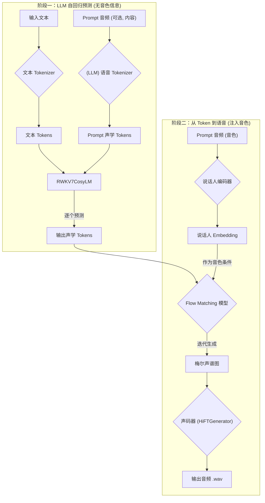
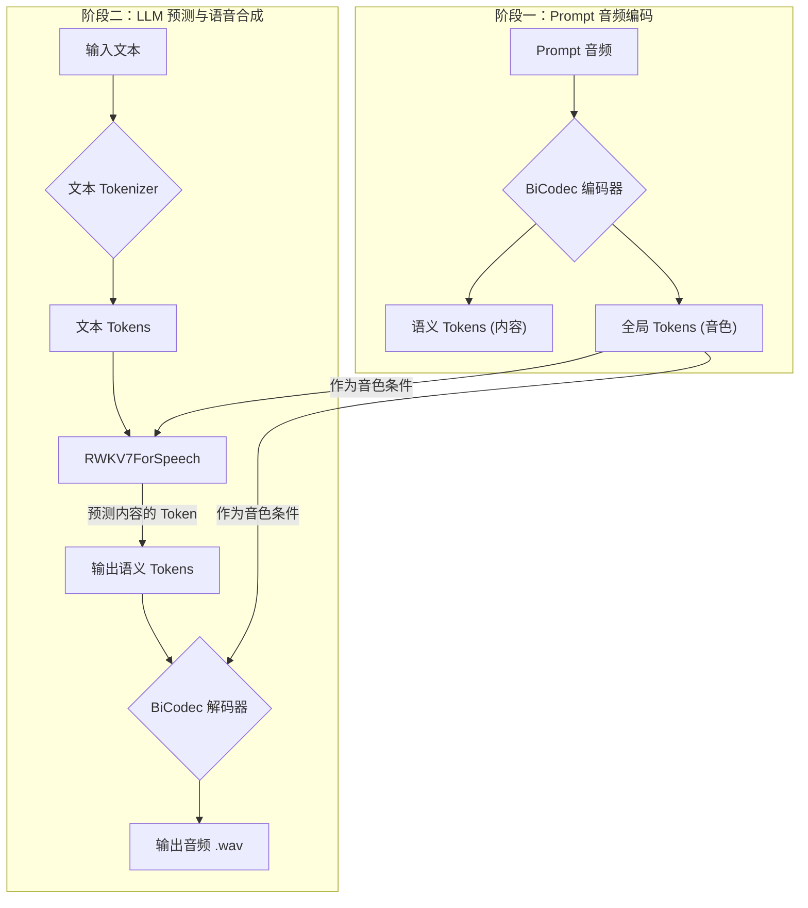
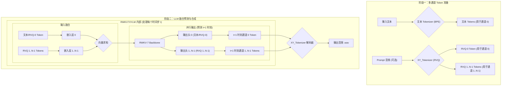

# RWKV-7 语音生成模型对比分析

本文档深入探讨了本项目中三种基于 RWKV-7 架构的语音生成大语言模型（LLM）：`CosyLM`、`SparkLM` 和 `XYLM`。尽管它们共享相同的高效 RWKV-7 骨架，但其核心区别在于对语音的表示方法（Tokenizer）以及生成语音的整体流程。

## 共同基础：RWKV-7 架构

RWKV 是一种创新的序列模型架构，它巧妙地结合了 RNN 的线性计算复杂度和 Transformer 的并行处理与自注意力机制的优点。这使得它在处理长序列（如语音）时，既能保持较低的计算和内存开销，又能拥有强大的序列建模能力，是这三个模型共同选择的强大基座。

---

## 1. `cosy_llm` (RWKV7CosyLM) - 单流声学 Token + Flow Matching

`RWKV7CosyLM` 是为 `CosyVoice` 项目设计的模型，其核心思想是经典的“文本到声学 Token”（Text-to-Acoustic-Token）的自回归生成，然后通过一个独立的 Flow Matching 模型将声学 Token 转换为声谱图。

### 核心流程

1.  **文本 Token 化**: 输入文本被转换为标准的文本 Token。
2.  **LLM 预测声学 Token**: `RWKV7CosyLM` 以自回归的方式，根据文本 Token 和（在 zero-shot 场景下）作为 Prompt 的语音 Token，逐个预测出代表语音的**单一流**离散声学 Token。**此阶段不使用说话人音色信息**。
3.  **Flow Matching 生成声谱**: **这是关键一步**。LLM 输出的声学 Token 无法直接生成音频。它们必须被送入一个独立的 **Flow Matching 模型**。该模型接收声学 Token 作为内容条件，并**额外接收一个说话人 Embedding 作为音色条件**，通过迭代优化的方式，将随机噪声逐步转化为符合这两种条件的梅尔声谱图（Mel-spectrogram）。
4.  **声码器合成语音**: 最后，由 Flow Matching 模型生成的梅尔声谱图被送入声码器（Vocoder，如 `HiFTGenerator`）合成最终的波形文件。

### 数据流图

### 特点总结

-   **两阶段生成**：流程清晰地分为“LLM 预测内容 Token”和“Flow Matching 注入音色并生成声谱”两个阶段。
-   **LLM 职责单一**：语言模型更精简，只负责文本到声学内容的转换，与音色解耦。
-   **依赖 Flow Matching**：Flow Matching 模型是实现高质量语音合成和音色控制的核心，它承载了将离散 Token 和音色向量融合并生成连续声谱的复杂任务。

---

## 2. `spark_llm` (RWKV7ForSpeech) - 内容与音色解耦的双 Token 建模

`RWKV7ForSpeech` 是为 `SparkTTS` 项目设计的，其核心思想是将语音的“内容”和“音色”进行解耦，通过两种不同的 Token 来分别表示。

### 核心流程

1.  **双路 Tokenizer (`BiCodec`)**:
    -   **语义 Token**: 输入的 Prompt 音频通过 `BiCodec` 的语义编码器（基于 wav2vec2）被转换成代表**语音内容**的离散 Token。
    -   **全局 Token**: 同时，该音频通过 `BiCodec` 的说话人编码器被转换成代表**全局音色**的离散 Token。
2.  **LLM 预测语义 Token**: `RWKV7ForSpeech` 接收文本 Token 和作为音色条件的全局 Token，然后自回归地预测出代表目标语音内容的**语义 Token**。
3.  **声码器融合解码**: `BiCodec` 的解码器（`WaveGenerator`）同时接收 LLM 预测出的**语义 Token** 和原始的**全局 Token**，将两者信息融合，直接合成最终的波形文件。

### 数据流图

### 特点总结

-   **内容/音色解耦**：通过两种独立的 Token 表示，实现了对音色的精准控制和高质量的语音克隆。
-   **端到端 Token 到语音**：LLM 的输出（语义 Token）与音色条件（全局 Token）可以直接被声码器用于合成，流程相对直接。
-   **依赖 `BiCodec`**：整个流程与 `BiCodec` 的双路编码/解码架构紧密耦合。

---

## 3. `xy_llm` (RWKV7XYLM) - 层级依赖的多通道并行建模

`RWKV7XYLM` 采用了一种独特且强大的建模方式，它通过一个共享的 RWKV-7 主干网络，来处理多个存在**层级依赖关系**的并行 Token 流。这种方法旨在以高保真度的方式，同时建模文本和精细的声学细节。

### 核心流程

1.  **多通道 Tokenizer (`XY_Tokenizer`)**:
    -   `XY_Tokenizer` 基于**残差矢量量化 (Residual Vector Quantization, RVQ)**。它包含 N 个级联的量化器（在此项目中 N=8）。
    -   **层级依赖**: RVQ 的工作方式是，第一个量化器对原始声学特征进行量化，得到第一个 Token (来自码本0)；然后，第二个量化器对**第一个量化器产生的残差（quantization error）**进行量化，得到第二个 Token (来自码本1)；以此类推。
    -   这种设计意味着，Token-0 捕捉了最主要的声学信息，而后续的 Token-1 到 Token-(N-1) 则逐步捕捉更精细的声学细节。因此，这 N 个 Token 流之间存在着从粗到细的**层级依赖关系**。

2.  **LLM 的多通道融合与并行预测**:
    -   **通道定义**: 模型定义了 `num_channels` 个通道。**关键在于，通道0被设计为“语义通道”，它同时处理文本 Token 和来自 RVQ 的第一个（最重要的）声学 Token**。其余通道（1 到 N-1）处理 RVQ 产生的后续细节 Token。
    -   **输入准备**:
        -   **文本 Token**: 由 `RWKV7XYLM` 自己的 BPE Tokenizer 生成。
        -   **声学 Token**: 由 `XY_Tokenizer` 生成 N 个并行的 Token 流（我们称之为 RVQ-0, RVQ-1, ..., RVQ-(N-1)）。
    -   **Embedding 生成 (对每一个时间步 `t`)**:
        1.  在 `t` 时刻，模型取出该时刻对应的所有通道的 Token。
        2.  **通道0 (语义通道)**: 将**文本 Token** 或 **RVQ-0 Token** 送入**通道0**的嵌入层 `self.embs[0]`，得到 `Emb_0`。
        3.  **通道1 (细节通道)**: 将 **RVQ-1 Token** 送入**通道1**的嵌入层 `self.embs[1]`，得到 `Emb_1`。
        4.  ...
        5.  **通道N-1 (细节通道)**: 将 **RVQ-(N-1) Token** 送入**通道N-1**的嵌入层 `self.embs[N-1]`，得到 `Emb_(N-1)`。
        6.  **输入融合**: 将这 N 个嵌入向量**逐元素相加** (`Emb_0 + Emb_1 + ... + Emb_(N-1)`)，形成一个融合了文本、主要声学特征和声学细节的单一向量。这个融合后的向量才是该时间步 `t` 送入 RWKV-7 主干网络的最终输入。
    -   **并行输出**: RWKV-7 的输出被送入 N 个并行的输出头 (`self.heads`)，每个头负责预测对应通道的下一个 Token。

3.  **层级位移 (Hierarchical Shift) 与解码**:
    -   **为何需要位移**: 由于 RVQ 的层级依赖性，模型在预测 `t` 时刻的第 `k` 个声学 Token (`RVQ-k`) 时，不仅需要 `t-1` 时刻的所有信息，还需要 `t` 时刻的前 `k` 个 Token (`RVQ-0` 到 `RVQ-(k-1)`) 的信息。
    -   **如何位移**: 为了在自回归模型中实现这一点，训练时采用了一种巧妙的**目标位移 (Target Shifting)** 策略。在准备训练数据时，第 `k` 个通道的声学 Token 序列会相对于第 `k-1` 个通道的序列向右**位移一个时间步**。这样，当模型在 `t` 时刻预测所有通道的 Token 时，它看到的输入历史自然就包含了 `t` 时刻 `channel 0` 到 `k-1` 的真实 Token，从而可以正确地预测 `t` 时刻 `channel k` 的 Token。
    -   **解码**: `XY_Tokenizer` 的解码器接收这 N 个并行的、带有层级依赖的 Token 流，将它们解码并融合成最终的音频波形。

### 数据流图

### 特点总结

-   **高保真与层级表示**：通过 RVQ 和多通道建模，实现了对声学特征的精细、分层的表示，有利于高质量生成。
-   **独特的模型结构**：其核心是**多通道输入的融合（求和）**和**多通道输出的并行预测**，以及为了处理 RVQ 层级依赖而设计的**目标位移**训练策略。
-   **统一建模**：将文本和多层声学信息在同一个模型中进行统一的自回归建模，结构优雅。
-   **端到端预测**：LLM 直接预测出可用于合成的完整声学表示，无需类似 Flow Matching 的中间步骤。

---

### 三种 LLM 的输入 Embedding 生成对比

为了更清晰地展示差异，下面将详细描述每个模型如何将文本和语音 prompt 转化为最终送入 RWKV-7 主干网络的 `inputs_embeds`。

#### 1. `cosy_llm` (RWKV7CosyLM)

-   **输入准备**:
    -   **文本**: 转换为文本 Token ID 序列。
    -   **语音 Prompt**: 转换为**单一流**的声学 Token ID 序列。
    -   **说话人音色**: **不送入 LLM**。单独提取为 Speaker Embedding 向量，供后续 Flow Matching 模型使用。
    -   **特殊 Token**: 准备 `SOS`, `Task_ID` 等特殊标记的 ID。

-   **Embedding 生成与融合**: **序列拼接 (Concatenation)**
    1.  分别通过各自的 Embedding 层获取向量：`Text_Emb`, `Speech_Emb`, `SOS_Emb`, `Task_Emb`。
    2.  将向量沿时间维度拼接起来，形成一个不包含说话人信息的序列：
        `inputs_embeds` = `torch.concat([SOS_Emb, Text_Emb, Task_Emb, Speech_Emb], dim=1)`

#### 2. `spark_llm` (RWKV7ForSpeech)

-   **输入准备**:
    -   **文本**: 转换为文本 Token ID 序列。
    -   **语音 Prompt**: 使用 `BiCodec` 编码为两种独立的 Token 序列：
        1.  **全局 Token (Global)**: 代表音色，通常是固定长度的几个 Token。
        2.  **语义 Token (Semantic)**: 代表内容，是变长的 Token 序列。

-   **Embedding 生成与融合**: **序列拼接 (Concatenation)**
    1.  通过不同的 Embedding 层获取向量：`Text_Emb`, `Global_Emb`, `Semantic_Emb`, `Tag_Emb`。
    2.  将这些向量拼接成一个序列。注意，这里的 `Semantic_Emb` 来自模型主 `embedding` 层，而其他有专属的 `embedder`。
        `inputs_embeds` = `torch.concat([Tag_Emb, Global_Emb, Text_Emb, Semantic_Emb], dim=1)`

#### 3. `xy_llm` (RWKV7XYLM)

-   **输入准备**:
    -   **文本**: 转换为文本 Token ID 序列。
    -   **语音 Prompt**: 使用 `XY_Tokenizer` (RVQ) 编码为 **N 个并行**的声学 Token 流 (RVQ-0, RVQ-1, ..., RVQ-(N-1))。
    -   **数据对齐**: 将文本 Token 和 N 个声学 Token 流在时间步上对齐。在某个时间步 `t`，可能只有一个通道有有效的 Token（文本或声学），其他通道则为 padding。

-   **Embedding 生成与融合**: **逐元素求和 (Element-wise Summation)**
    1.  在**每一个时间步 `t`**，对所有通道并行操作：
        -   `Emb_0` ← `self.embs[0](文本_ID_t 或 RVQ-0_ID_t)`
        -   `Emb_1` ← `self.embs[1](RVQ-1_ID_t)`
        -   ...
        -   `Emb_(N-1)` ← `self.embs[N-1](RVQ-(N-1)_ID_t)`
    2.  将该时间步 `t` 的 N 个 Embedding 向量**逐元素相加**，得到最终送入主干网络的单一向量：
        `inputs_embeds_t` = `Emb_0 + Emb_1 + ... + Emb_(N-1)`

---

## 综合对比

| 特性 | `cosy_llm` (RWKV7CosyLM) | `spark_llm` (RWKV7ForSpeech) | `xy_llm` (RWKV7XYLM) |
| :--- | :--- | :--- | :--- |
| **核心思想** | 单流声学 Token + Flow Matching | 内容与音色解耦的双 Token 建模 | 层级依赖的多通道并行建模 |
| **语音 Tokenizer** | `CosyVoice` Speech Tokenizer | `SparkTTS` BiCodec | `XY_Tokenizer` (RVQ) |
| **Token 表示** | 单一流 (Acoustic) | 双流 (Semantic + Global) | N 个并行流 (Acoustic, 层级依赖) |
| **LLM 输入处理** | 序列拼接 | 序列拼接 | 逐元素求和 |
| **LLM 输出** | 单一的声学 Token | 单一的语义 Token | N 个并行的声学 Token |
| **生成流程** | **两阶段**：LLM -> Flow Matching -> Vocoder | **单阶段**：LLM -> Decoder | **单阶段**：LLM -> Decoder |
| **优缺点** | **优点**: LLM 任务清晰简单，与音色完全解耦；可借助强大的 Flow Matching 模型保证最终语音的高品质。 **缺点**: **两阶段生成**，系统复杂；Flow Matching 的**迭代特性**导致生成速度显著慢于单阶段模型。 | **优点**: 内容和音色解耦清晰，音色控制精准；**LLM 直接预测可解码的 Token，为单阶段生成，性能和速度大幅优化**。 **缺点**: `BiCodec` Tokenizer 相对复杂；全局音色 Token 是对整段语音的单一表示，可能难以捕捉句内韵律的动态变化。 | **优点**: RVQ 多通道表示能捕捉丰富声学细节，利于高保真合成；**同样为单阶段预测，LLM 直接输出完整的可解码声学表示，性能和速度有保障**。 **缺点**: LLM 建模任务非常复杂，需学习并行 Token 间的层级依赖；训练难度大，底层 Token 的预测错误易导致上层细节的连锁错误。 |
