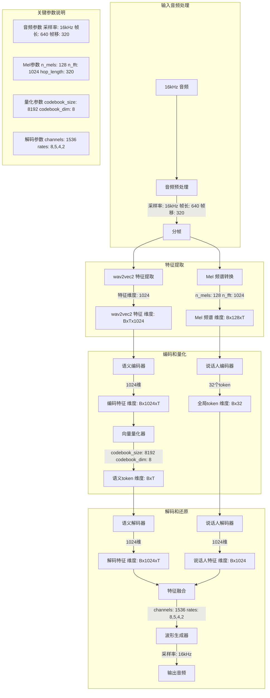

```mermaid
graph TD
    subgraph 输入音频处理
        A[16kHz 音频] --> B[音频预处理]
        B -->|采样率: 16kHz 帧长: 640 帧移: 320| C[分帧]
    end

    subgraph 特征提取
        C --> D1[Mel 频谱转换]
        C --> D2[wav2vec2 特征提取]
        
        D1 -->|n_mels: 128 n_fft: 1024| E1[Mel 频谱 维度: Bx128xT]
        D2 -->|特征维度: 1024| E2[wav2vec2 特征 维度: BxTx1024]
    end

    subgraph 编码和量化
        E1 --> F1[说话人编码器]
        E2 --> F2[语义编码器]
        
        F1 -->|32个token| G1[全局token 维度: Bx32]
        F2 -->|1024维| G2[编码特征 维度: Bx1024xT]
        
        G2 --> H[向量量化器]
        H -->|codebook_size: 8192 codebook_dim: 8| I[语义token 维度: BxT]
    end

    subgraph 解码和还原
        I --> J1[语义解码器]
        G1 --> J2[说话人解码器]
        
        J1 -->|1024维| K1[解码特征 维度: Bx1024xT]
        J2 -->|1024维| K2[说话人特征 维度: Bx1024]
        
        K1 --> L[特征融合]
        K2 --> L
        
        L -->|channels: 1536 rates: 8,5,4,2| M[波形生成器]
        M -->|采样率: 16kHz| N[输出音频]
    end

    subgraph 关键参数说明
        P1[音频参数 采样率: 16kHz 帧长: 640 帧移: 320]
        P2[Mel参数 n_mels: 128 n_fft: 1024 hop_length: 320]
        P3[量化参数 codebook_size: 8192 codebook_dim: 8]
        P4[解码参数 channels: 1536 rates: 8,5,4,2]
    end
```